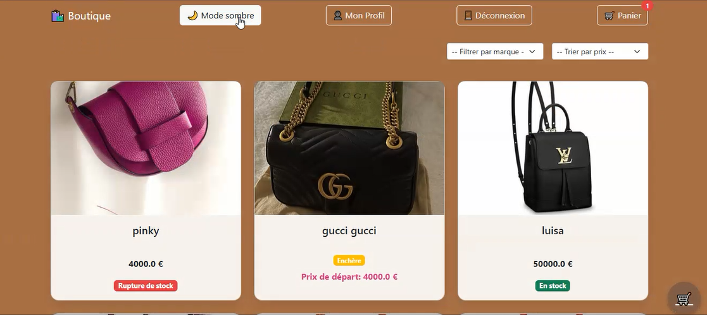
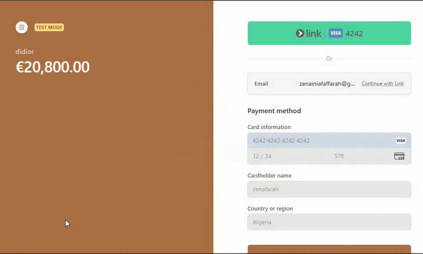
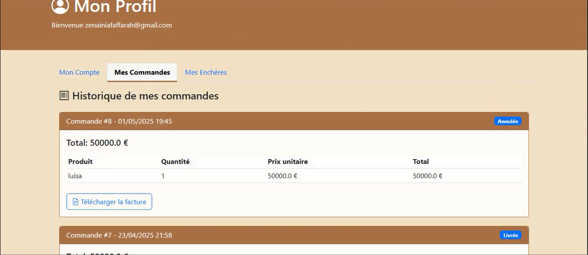
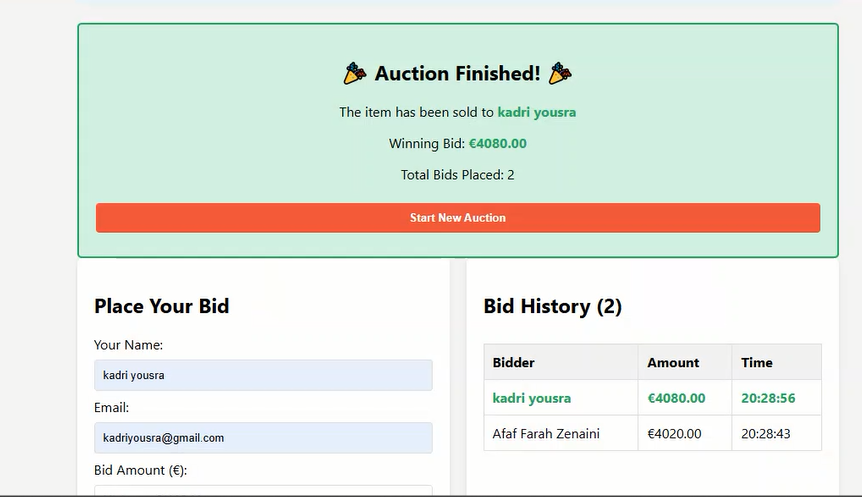
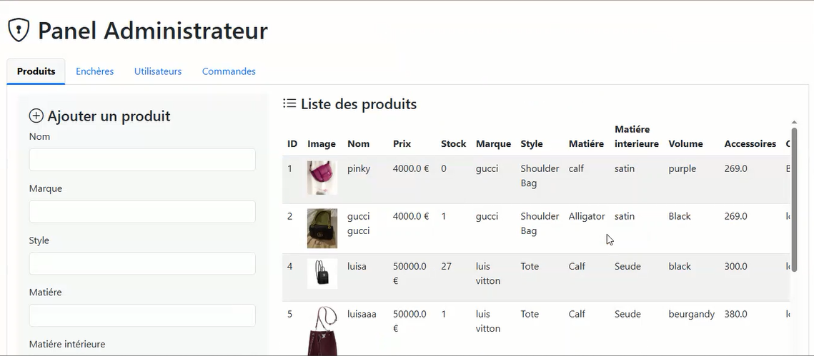
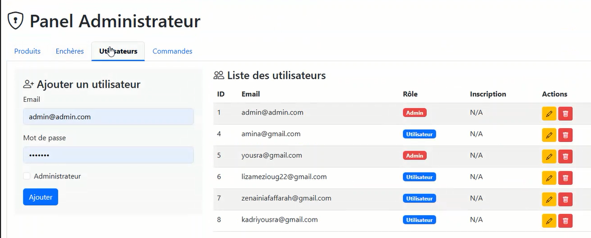
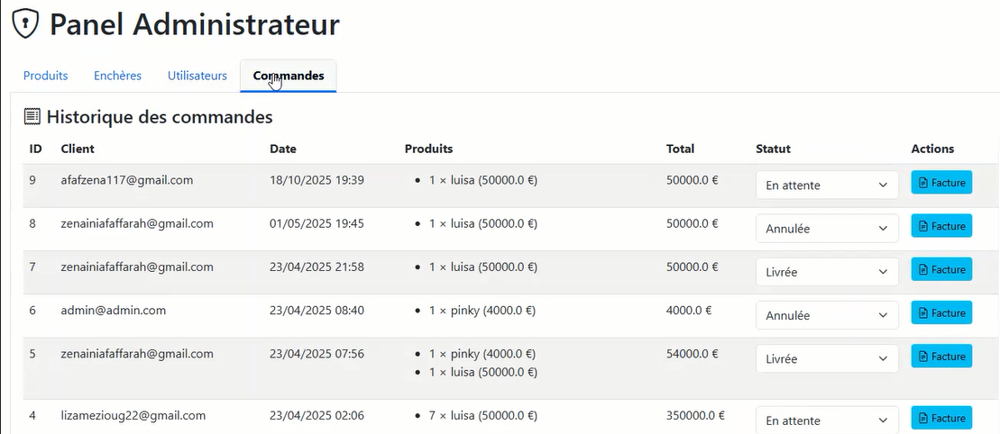
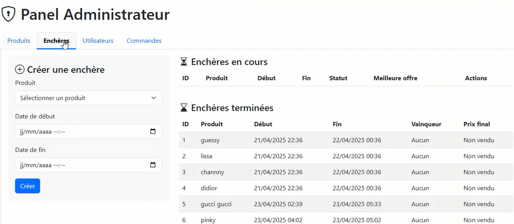

# 👜 AI-Powered Handbag E-Commerce Platform

An intelligent e-commerce platform that combines traditional online shopping with Machine Learning to estimate handbag prices before they are listed for auction.

The platform enables customers to browse products, purchase handbags, participate in online auctions, and securely complete payments. Administrators can manage products, users, orders, auctions, and use an AI-powered price prediction model to estimate the selling price of handbags.

---

## ✨ Features

### 👤 Customer

- User registration and authentication
- Browse handbag catalog
- Search and filter products
- View product details
- Shopping cart
- Wishlist
- Secure payment with Stripe
- Order history
- Participate in online auctions
- User profile management

---

### 🤖 AI Price Prediction System

The platform integrates a Machine Learning model to estimate the price of handbags before they are listed for auction.

The prediction process includes:

- Data collection
- Data preprocessing and cleaning
- Feature engineering
- Model training
- Price estimation

The prediction model uses the following handbag characteristics:

- Brand
- Bag Style
- Material
- Color
- Capacity (Volume)
- Accessories

**Machine Learning Model**

- Random Forest Regressor (Scikit-learn)

---

### 🔨 Auction System

Customers can:

- Browse active auctions
- Place bids
- Track auction status
- Win products through competitive bidding

Administrators can:

- Predict the starting auction price using AI
- Create auctions
- Activate or close auctions
- Manage auction products

---

### 👨‍💼 Administrator

- Product management
- Inventory management
- User management
- Order management
- Auction management

---

## 🛠️ Technologies

### Backend

- Python
- Flask
- SQLAlchemy

### Frontend

- HTML5
- CSS3
- Bootstrap
- JavaScript

### Machine Learning

- Scikit-learn
- Random Forest Regressor
- Pandas
- NumPy
- Joblib

### Database

- SQLite

### Payment

- Stripe API

---

## 📁 Project Structure

```text
AI-Handbag-Ecommerce/
│
├── images/                  # README screenshots
├── static/                  # CSS, JavaScript, uploaded images
├── templates/               # HTML templates
├── instance/                # SQLite database
│
├── app.py                   # Main Flask application
├── recommendation_model.pkl # Trained Random Forest model
└── README.md
```

---

## 🚀 Installation

Clone the repository

```bash
git clone https://github.com/zenainiafaf/AI-Handbag-Ecommerce.git
```

Move to the project directory

```bash
cd AI-Handbag-Ecommerce
```

Install the required packages

```bash
pip install -r requirements.txt
```

Run the application

```bash
python app.py
```

Open your browser

```
http://127.0.0.1:5000
```


---

## 📸 Application Preview

### 🏠 Home Page

<p align="center">

</p>

---

### 🔐 Login

<p align="center">

</p>

---

### 👜 Product Details

<p align="center">

</p>

---

### 💳 Stripe Payment

<p align="center">

</p>

---

### 👤 User Profile

<p align="center">

</p>

---

### 🔨 Online Auction

<p align="center">

</p>

---

### 👨‍💼 Admin Dashboard – Product Management

<p align="center">

</p>

---

### 👥 Admin Dashboard – User Management

<p align="center">

</p>

---

### 📦 Admin Dashboard – Order Management

<p align="center">

</p>

---

### 🔨 Admin Dashboard – Auction Management

<p align="center">

</p>

---

## 🚀 Future Improvements

- Improve the price prediction model using Gradient Boosting or XGBoost
- Image-based handbag price estimation
- Advanced analytics dashboard
- Email notifications
- Product reviews and ratings
- Mobile application
- Multi-language support

---

## 👩‍💻 Author

**Farah Zenaini**

Master's Student in Artificial Intelligence

University of Science and Technology Houari Boumediene (USTHB)

---

## ⭐ Support

If you found this project useful, please consider giving it a ⭐ on GitHub.
